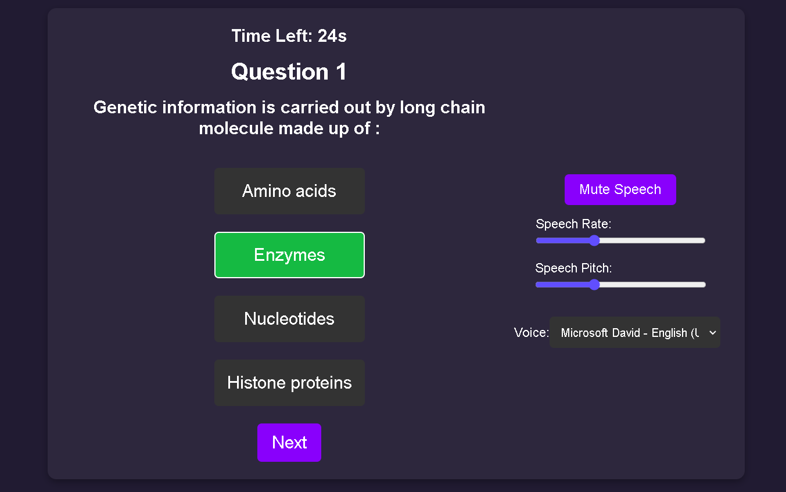
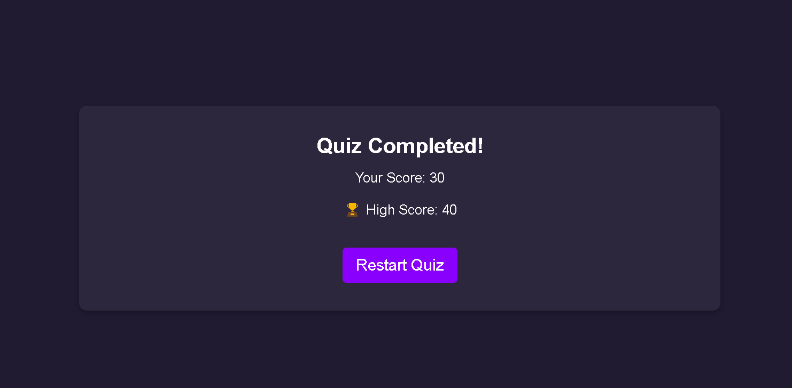

# Gamified Quiz App
## 
Discription

  
A dynamic, interactive quiz application with gamification features like streak bonuses, timers, speech synthesis, and a leaderboard. It’s built with gamification features like streak bonuses, timers, speech synthesis, and real-time progress tracking, keeping users motivated and engaged.
    
## 🧐 Features    
- API Fetching – Fetches quiz data from https://api.jsonserve.com
- Timer – It has a 30 second timer for each question 
- Speech Synthesis – It speaks the "right answer well done" for correct response and "wrong answer try again" for wrong answer 
- Customizable Voice Settings – User can adjust rate, pitch, and voice.
- Points – Reward points for each correct answer
- Streak Bonus – Rewards consecutive correct answers.
- High Score Tracking – Stores best scores using local storage.
## 🛠️ Tech Stack
- [React](https://reactjs.org/)
- [Node.js](https://nodejs.org/)
- [Express.js](https://expressjs.org/)
- [CSS](https://developer.mozilla.org/en-US/docs/Web/CSS/)
    

        
[Deno-https://gamified-quiz-app-frontend.onrender.com/](https://gamified-quiz-app-frontend.onrender.com/)
        
## 🧑🏻‍💻 Usage
- Start the Quiz by clicking the "Start Quiz" button.

- Answer questions before the timer runs out.

- Earn bonus points for streaks.

- Adjust speech settings (mute, change voice, modify speed & pitch). 

- Check your high score after the quiz. 

- Click "Restart Quiz" to try again with shuffled questions. 
        
## 🙇 Author
#### Suyash Gandhi
- Gmail: [suyash25gandhi@gmail.com](mailto:suyash25gandhi@gmail.com)
- Github: [https://github.com/Suyash-Gandhi](https://github.com/Suyash-Gandhi)
        
